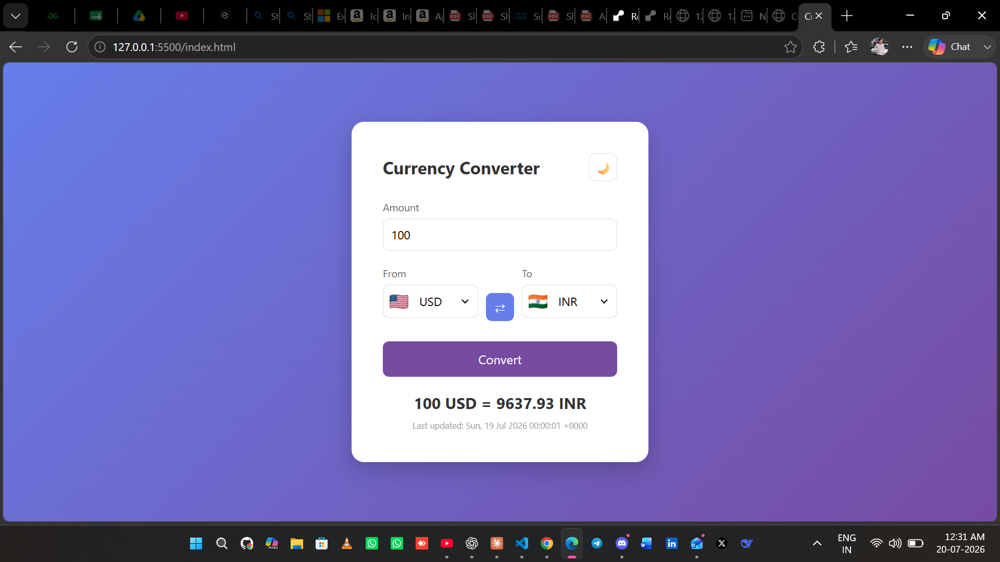
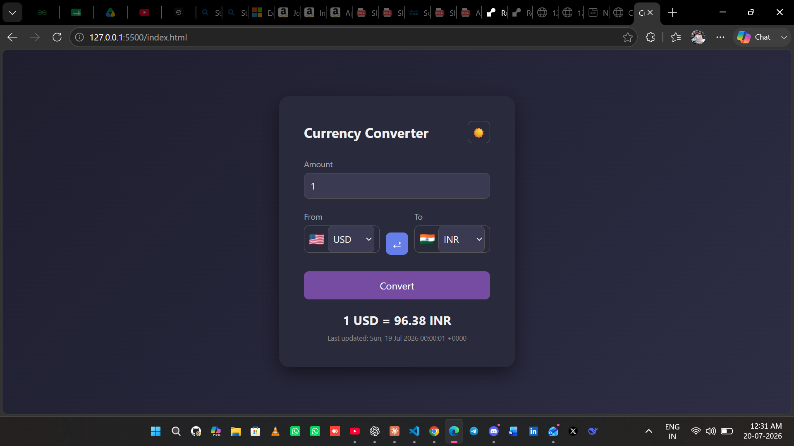

# 💱 Currency Converter

A simple, responsive currency converter web app that fetches **live exchange rates** and lets you convert between 160+ world currencies — with dark mode, flag icons, and a clean UI.

(screenshot.png)

## ✨ Features

- 🔄 **Live exchange rates** — fetched in real-time from ExchangeRate-API
- 🌙 **Dark / Light mode toggle** — with preference saved in localStorage
- 🏳️ **Flag icons** — visual currency identification next to each dropdown
- ⇄ **Swap button** — instantly flip From/To currencies
- ⏳ **Loading spinner** — smooth UX while rates are being fetched
- 📱 **Responsive design** — works on desktop and mobile
- 🕒 **Last updated timestamp** — always know how fresh the rates are

## 🛠️ Tech Stack

- HTML5
- CSS3 (Flexbox, CSS Variables, Animations)
- Vanilla JavaScript (Fetch API, async/await, DOM manipulation)
- [ExchangeRate-API](https://www.exchangerate-api.com/) — free live currency rates
- [FlagCDN](https://flagcdn.com/) — free flag icons

## 🚀 Live Demo

🔗 [View Live Demo](#) <!-- Add your deployed link here once live -->

## 📸 Preview

| Light Mode | Dark Mode |
|------------|-----------|
|  |  |

## 💻 Run Locally

1. Clone this repository
```bash
   git clone https://github.com/Shlokverma0/currency-converter.git
```
2. Navigate into the project folder
```bash
   cd currency-converter
```
3. Open `index.html` in your browser (or use VS Code's Live Server extension)

That's it — no build tools or dependencies needed!

## 🔑 API Key Note

This project uses a free-tier [ExchangeRate-API](https://www.exchangerate-api.com/) key directly in the client-side JavaScript for simplicity, since it's a beginner-friendly static project.

> ⚠️ In production applications, API keys should never be exposed in client-side code — they should be stored securely in environment variables on a backend server.

If you clone this project, get your own free API key at [exchangerate-api.com](https://www.exchangerate-api.com/) and replace it in `script.js`.

## 📂 Project Structure
currency-converter/
├── index.html
├── style.css
├── script.js
└── README.md
## 🎯 What I Learned

- Working with REST APIs using `fetch()` and `async/await`
- DOM manipulation and event handling in vanilla JavaScript
- Implementing persistent user preferences with `localStorage`
- Building responsive, accessible UI with pure CSS
- Structuring a clean, maintainable front-end project

## 📄 License

This project is open source and available under the [MIT License](LICENSE).

## 🙋‍♂️ Author

**Shlok Verma**
- GitHub: [@Shlokverma0](https://github.com/Shlokverma0)

---
⭐ If you found this project helpful, consider giving it a star!
